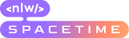
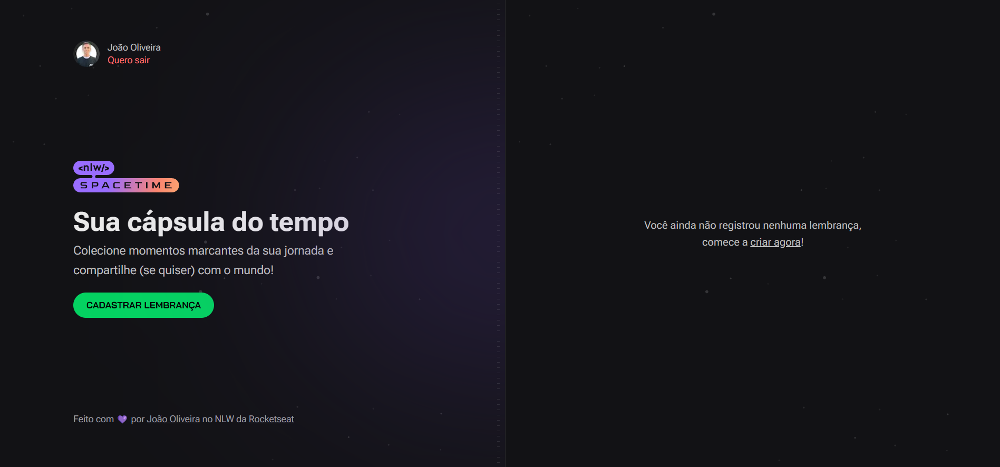
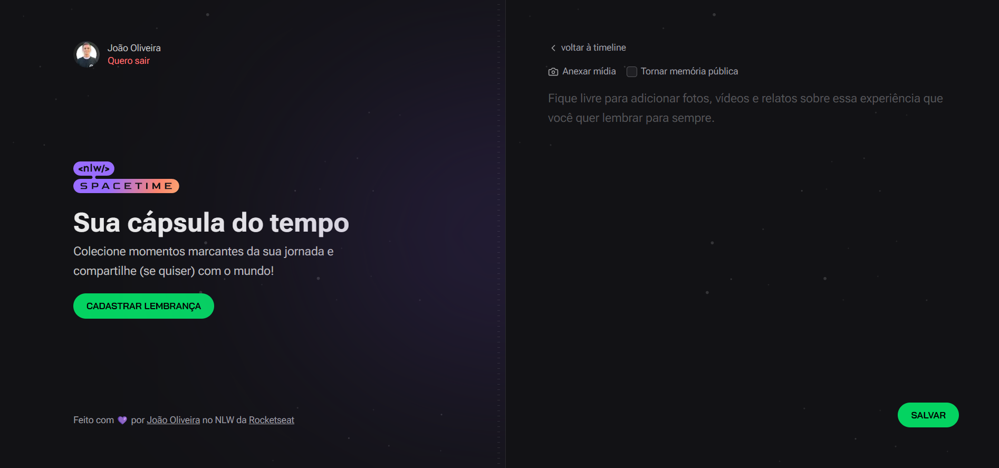
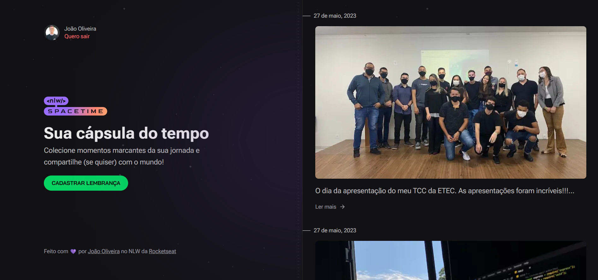
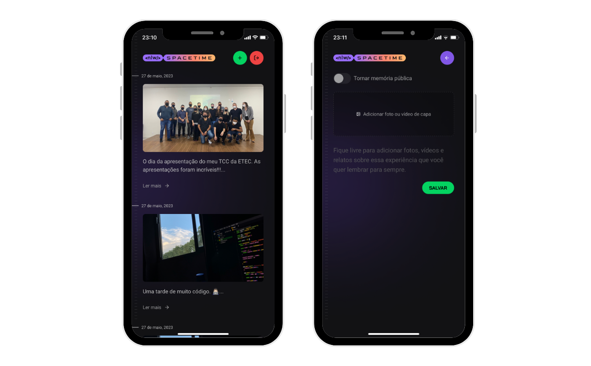

---

[Projeto](#spacetime) • [Imagens do projeto](#screenshots) • [Tecnologias](#tecnologias) • [Contato](#contato)

# Spacetime

O Spacetime foi desenvolvido durante o evento NLW (Next Level Week) 12 da [Rocketseat](https://rocketseat.com.br) na trilha Ignite.

O projeto é uma cápsula do tempo onde podemos postar na timeline textos, fotos e vídeos de momentos especiais de nossa vida, organizados por mês e ano.

## Screenshots

### Screen da página home sem memórias

### Screen da página de criar novas memórias

### Screen da página home com algumas memórias

## Screenshots Mobile

## Tecnologias

- React
- React Native
- Next.js
- TypeScript
- JavaScript
- Axios
- JWT
- Node
- Fastify
- Prisma
- Zod
- Expo
- TailwindCSS

## Contato
Criado por João Oliveira

